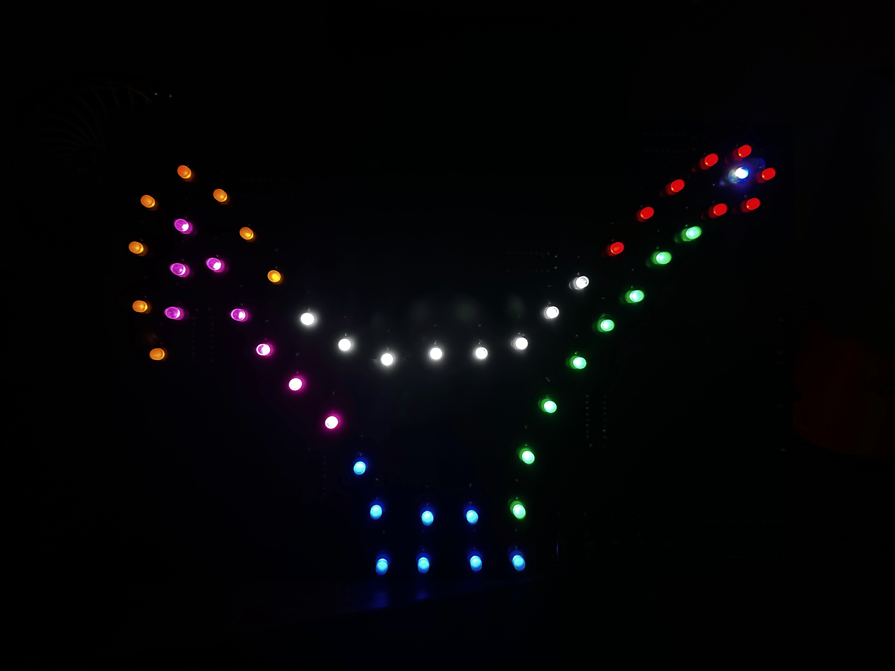

# ARDUINO BLINK PROGRAM IN c WITHOUT ARDUINO LIBRARY
- use as starter template for arduino code without arduino framework
- build & upload to connected arduino to compile & upload project to chip
    - run `ls -a /dev/tty.*` to get name of usb port to upload to. must set this as $USBPORT in scripts/bld.sh to upload
- setup for atmega328p chip
- from root run `./scripts/bld.sh` to compile & upload

## breadboard example

