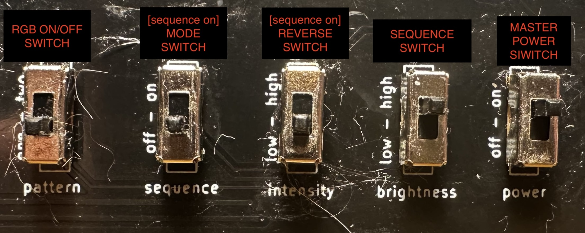
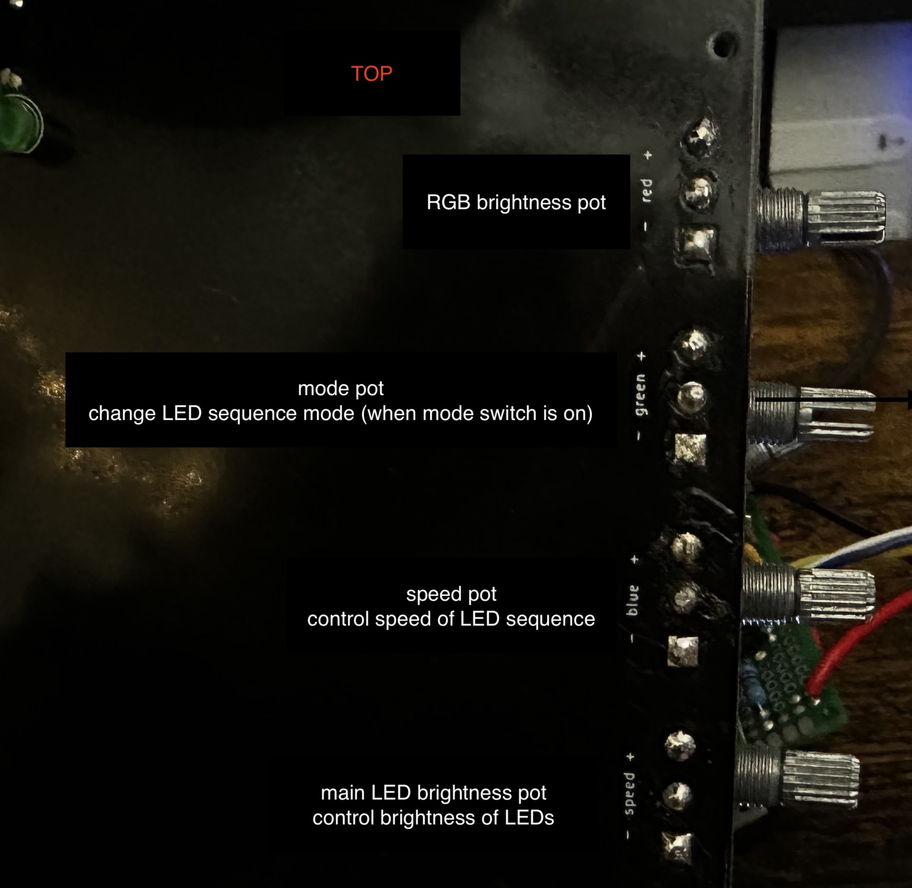

# quick reference to the switches/knobs on bronto
## external requirements
- a standard USB-C cable/power block is required to power the device
    - the cable plugs into the Arduino on the lower right side of the back of the baord
## NOTE: aside from the power switch, the labels on the board do NOT correspond with their actual purpose
## switches reference
 
- ### master power switch
    - turns on/off entire circuit - when switch is off, no lights will turn on
- ### sequence switch (*brightness label*)
    - when off, all LEDs are lit
    - when on, LED sequence is run
- ### reverse switch (*intensity label*)
    - reverses direction of LED sequence
    - only active when sequence switch is on
- ### mode switch (*sequence label*)
    - when on, the mode pot (referenced in pots section below) determines the LED sequence mode
    - when off, the standard *bit chaser* sequence (one light on at a time) is run
    - only active when sequence switch is on
- ### rgb switch (*pattern label*)
    - turns RGB LED on/off
## potentiometers *(pots/knobs)* reference
 
### *pots referenced from bottom of board to top*
- ### brightness pot (*speed label*)
    - controls the brightness of the main 48 LEDs (not the RGB)
- ### speed pot (*blue label*)
    - controls the speed (*amount of delay between bits in LED sequence*) of the sequence
    - only active when sequence switch is enabled
- ### mode pot (*green label*)
    - controls the LED sequence mode
    - only active when both sequence and mode switch are enabled
- ### rgb brightness pot (*red label*)
    - control RGB LED brightness
    - only active when RGB switch is on